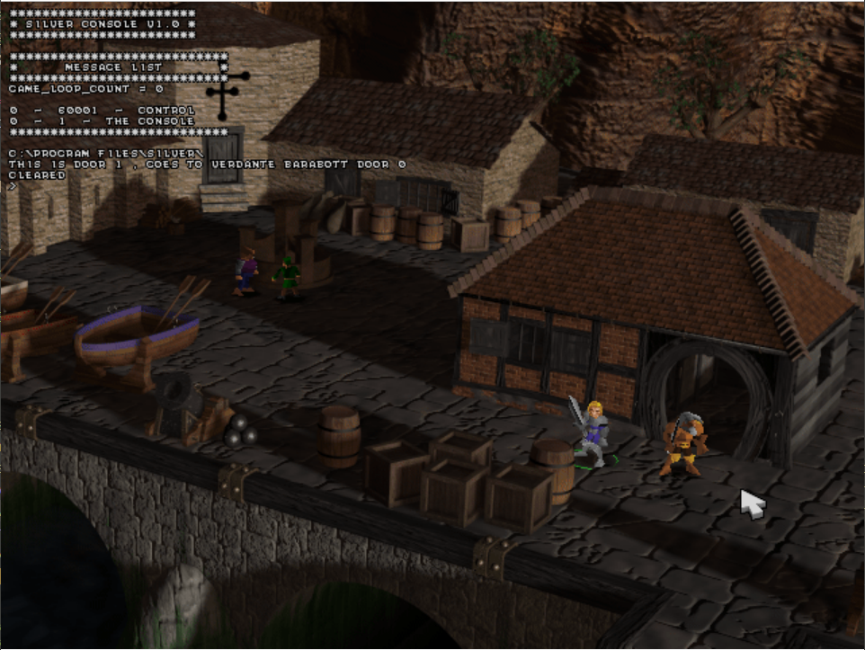

[<- Back to the Docs](../index.md)

# Activating the game's console

The early versions of the original silver (prior to steam) has a built-in console for debugging puposes!
I've managed to enable a read-only version of it (for now) so we can access debug information logged into the screen.

*An image of the silver console activated*

Using the .tsct compiler we can call the [log string function](../catalog/func_refs/205.md) or [log var function](../catalog/func_refs/206.md) to log into the console.

### Download

*If you have the older versions of silver that run on older operating systems such as Win 98 or Win XP (I personally use 86box for this purpose.)*

Simply replace the silver.exe file with this patched version I made to enable the read-only access to the console:

[Download patch](./silver.exe)
