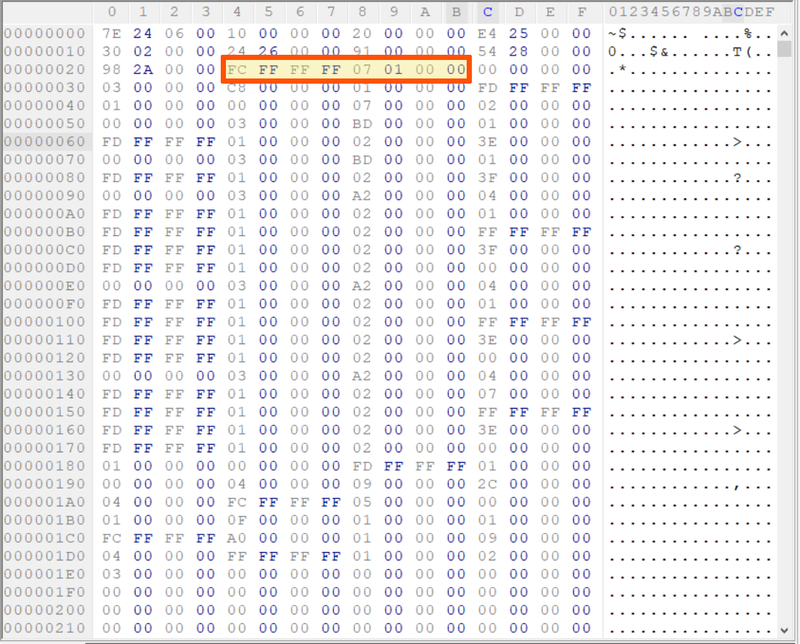
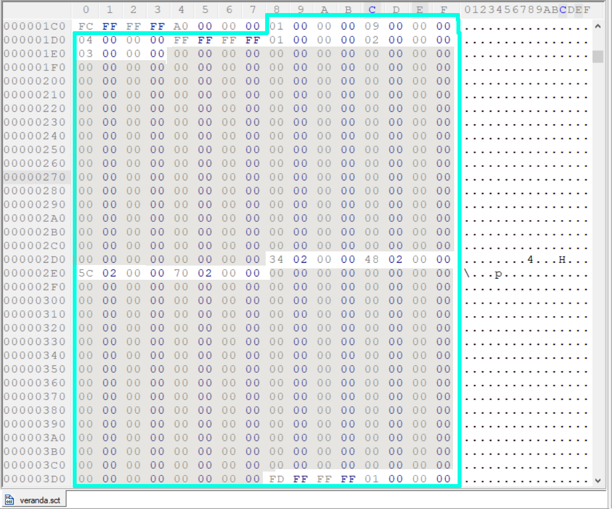
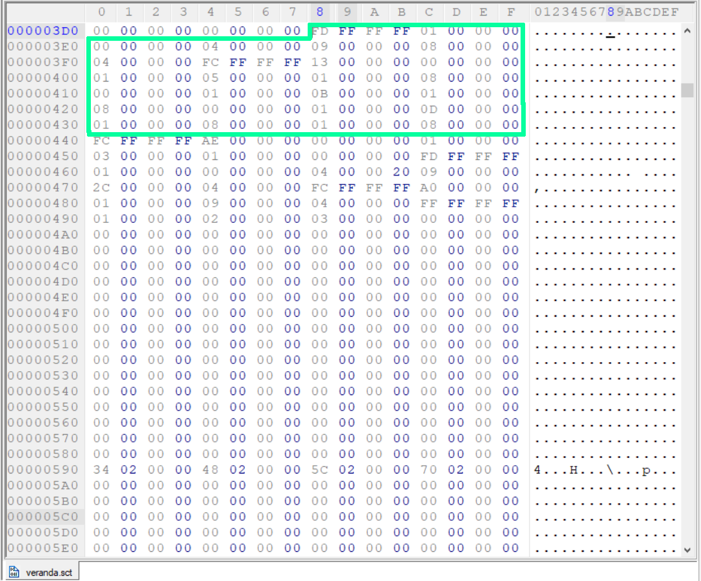
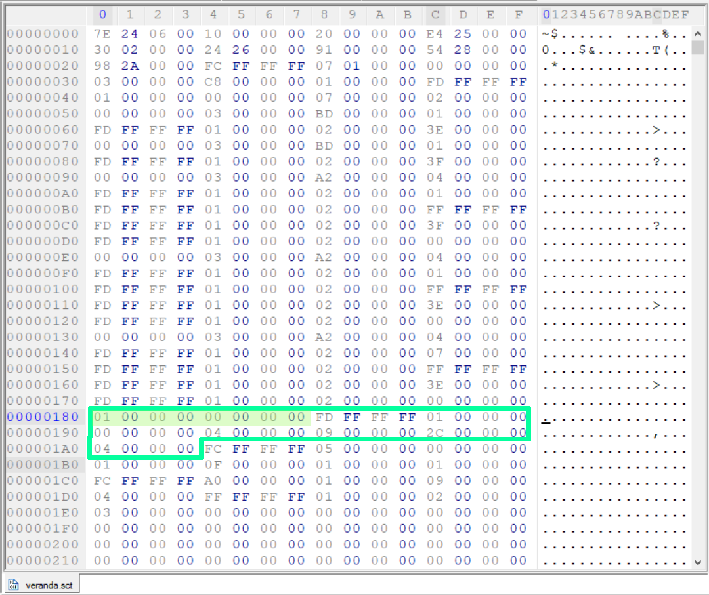
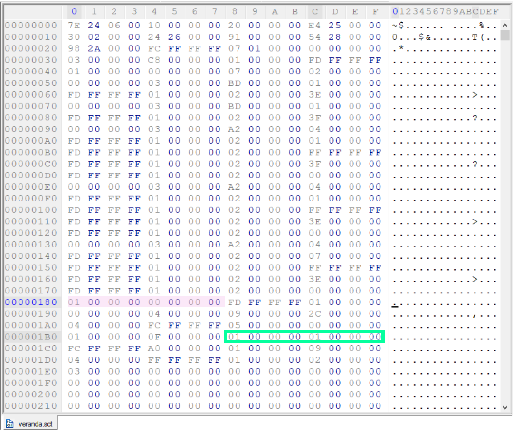
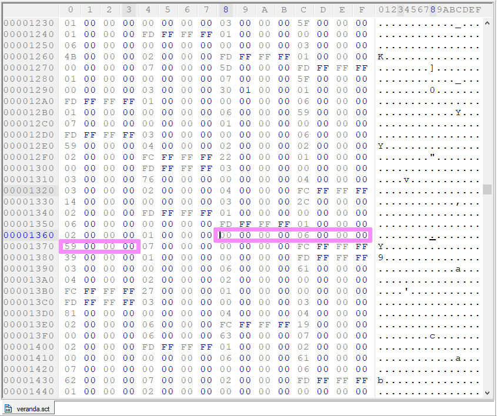
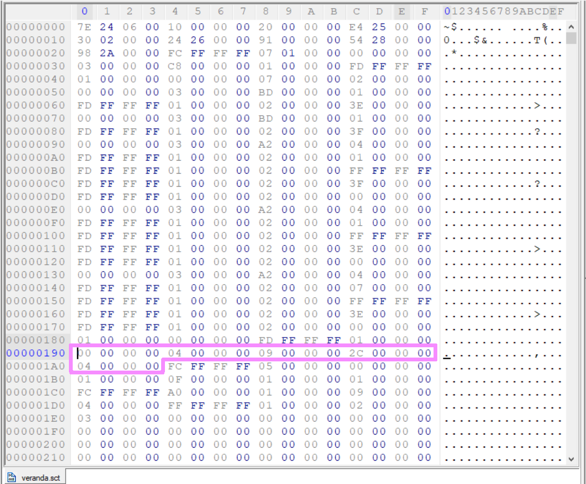
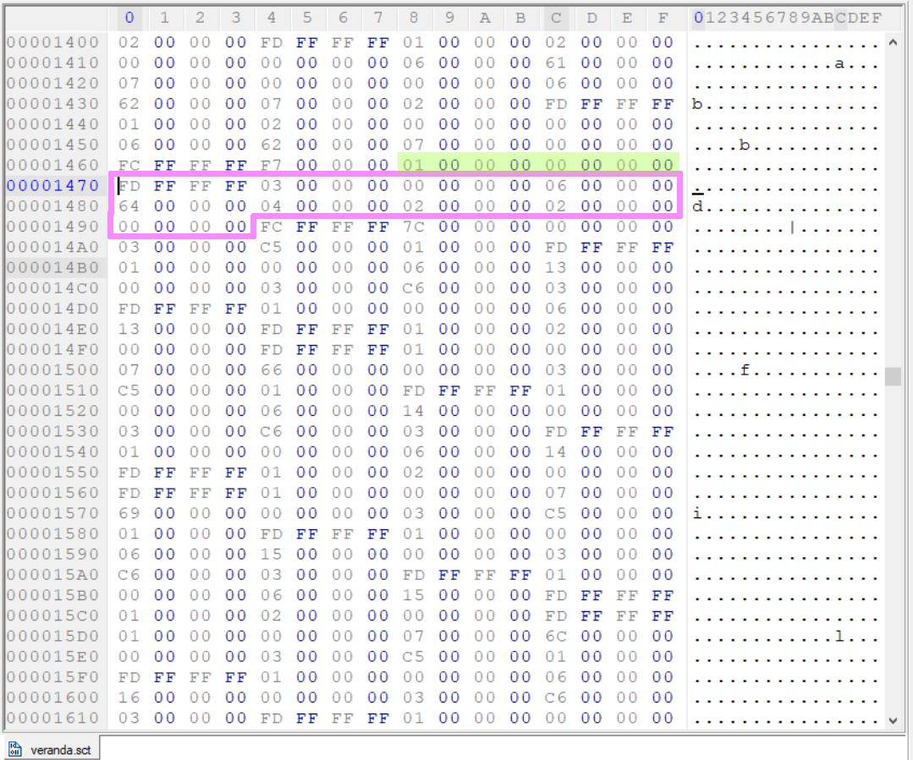
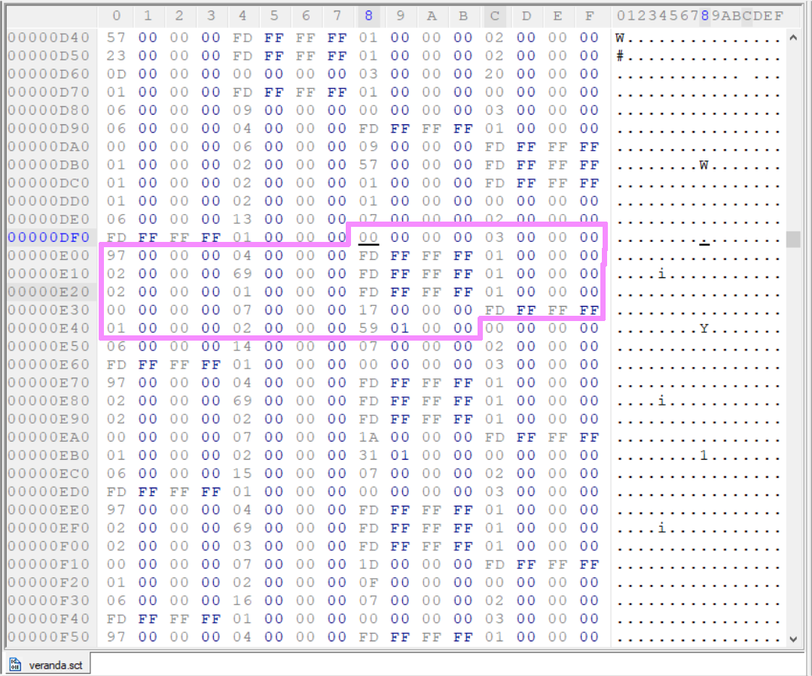
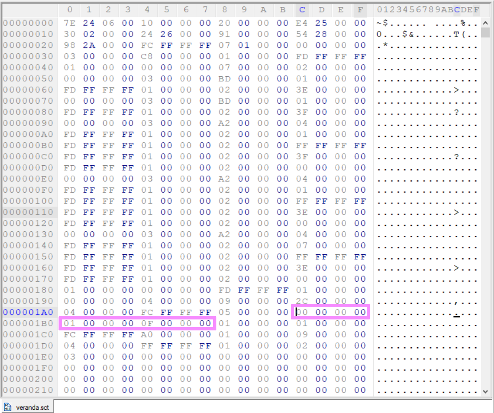

[<- Go Back](./format.md)

## The code section
The code section is where most of the magic happens, ie - the scripts are being described and later interpreted by the game's engine.
Here I'll focus mainly on it's code structures.

The structures are: 
- [script](#script)
- [code block](#code-block)
- [switch statement](#switch-statement)
- [if statement](#if-statement)
- [else statement](#else-statement)
- [while loop (of sorts)](#while-loop)
- [literals](#literals)
- [variables](#variables)
- [binary and unary operators](#binary-and-unary-operators)
- [expression](#expression)
- [increment](#increment)
- [decrement](#decrement)
- [assignment](#assignment)
- [function call](#function-call)
- [script call](#script-call)
- [return](#return)

## Script
This structure is basically one big [code block](#code-block) structure except that it's offset is recorded in the [scripts table](./script.md) section so it can be called by the [main script](./format.md#predefined-execution-rules). 

It's important to note some basic [predefined rules](./format.md#predefined-execution-rules) to know which script is the main one (first to be executed) and so on.

## Code block
A code block is a collection of instructions, these are grouped together by denoting it's size.

a code block is declared in the binary file using the Integer 0xFFFFFFFC (In hex) followed by another 4 bytes denoting I'ts size.

for instance: (the main script of [veranda.sct](./veranda.sct) is declared like so)



## Switch statement
This code structure made me scratch my head for a very long time until it finally dawned upon me. it's structure seems messy to look at at first inside a hex editor, beware. 

#### A declaration of a switch-case statement look like this: (offsets here are from the start of the declaration).

1. ```0x00000001 0x00000009``` (8 Bytes) Followed by an integer representing the number of cases. (Let's call it N)

2. Then we have an offset for the default case or ```0xFFFFFFFF``` (-1) if there is'nt any. 

3. Then we have N integers denoting the values for each Case. 

4. Then some padding (0x00), the offsets for each of the cases, followed by more padding.

5. An Expression for the switch statement.

6. Finally a code block with all the cases. 

A Break statement is denoted by 0x00000001 0x00000008.

For example: (In the C language)
```
Switch(expression) {
    case 1:
        break;
    case 2:
        break;
    default:
        break;
}
```
Would translate to:
```
0x00000001 0x00000009 0x00000002 [offset to default case] 0x00000001 0x00000002 [padding] 
[offset to case 1] [offset to case 2] [Expression] [Code Block]
```

Let's take a look at one of veranda.sct's switch-case structure inside the Hex editor:



_The padding is marked in grey (I accidently marked 0x01E4-0x01E8 as if it was padding in the above image, it's not.)_

In the above switch-case structure: 
- there are 4 cases.
- there's no default case.
- the cases values are 1, 2, 3, 0.


Also, the expression and code blocks are left out in this image. but they are located right below:




## If statement
An if statement is denoted using 8 Bytes like so:

``` 0x00000001 0x00000000 [Expression] [Code block] ```

if the expression is truthy the code block will be executed.



_You can see the if statement in the image followed by an expression and the code block after the mark._

## Else statement
An else statement has to follow an if statement and is denoted using 8 Bytes like so:

``` 0x00000001 0x00000001 [Code block] ```

if the expression of the if statement above the else statement is falsy then this code block will be executed.



_You can see the if statement marked in pink in the image, the else statement is marked in green._

## While loop
This is'nt exactly a while loop in the ordinary sense, I mean, it does loop, but there's a finite number of iterations it can make before it times out. It can be useful for repeating instructions but if you want an actual loop it's probably better to use the [loop script](./format.md#predefined-execution-rules) as it loops infinitly. In any case, it does appear in the game's files so here it is:


A while loop is denoted using 8 Bytes like so:

``` 0x00000001 0x00000007 [Expression] [Code block] ```

if the expression is truthy the code block will be executed until it is'nt or until it times out :).

## Literals
In .sct format there are only integer literals.

An integer literal is enabling us to use numbers in an [expression](#expression) to perform operations on, such as assignment, addition, multiplication and so on..

Their binary form is as follows:
```
Usage:
------
0x00000002 [number]

Example:
--------
abstract: the number 9
binary: 0x00000002 0x00000009
```
As mentioned above, they are used in an [expression](#expression), 

#### so a more complete example would be:

(using a [variable](#variables) and an [assignment](#assignment))
```
abstract: VAR_1 = 10
binary: 0x00000000 0x00000006 0x00000001 0x00000007 0x00000002 0xFFFFFFFD 0x00000001 0x00000002 0x0000000A


---Separated to the different components (for simplicity):---
VAR_1:
0x00000000 0x00000006 0x00000001 

=:
0x00000007 0x00000002 

expression of size 1:
0xFFFFFFFD 0x00000001 

integer literal (the number 10):
0x00000002 0x0000000A

```

## Variables
There are two types of variables:
1. data variable (and its [types](./data.md))
2. game variable (as can be seen [here](../catalog/gamevars.md))

### Data variable
A data variable is simply a pointer to a location in the script's data section, (via the [link table](./link.md)) 

A game variable is referencing variables outside .sct files. instead, it gives read/ write access to some of the game's data.

In sct binary, a variable look like so:
```
0x00000000 0x00000006 [Variable number]
Variable number is denoting how many integers from the beginning of the data section the var is located.

So, to reference the first integer/ string/ integer array in the data section (to use it as variable), we'll write:
0x00000000 0x00000006 0x00000000

And if we want the 8 bytes after that?
it's offset in the data section is 0x0C (0x08 + 0x04) so it is 3 integers from the start (0x0C / 0x04, because an integer is 4 bytes):
0x00000000 0x00000006 0x0000003


Combined with other code structures, its usage becomes much more clear.

```

Here's what a data variable looks like in veranda.sct:



_Here the var refrences 0x59*0x04 bytes from the beginning of the data section_

### Game variable
A game variable on the other hand is a bit more complex.

It's essentialy a memory pointer to the game's memory.

It is composed of 3 parts, 20 bytes in total:
- **A type (8 bytes)**
There are 2 known types: 
    - The first type and the main one seem to be all the global variables we get access to. (for instance: MOUSE_X)
    - The second type are variables that depend on the game's state and change according to another game var. (for instance: script_timer - it depends on the script)
- **Two offsets (4 bytes each, 8 bytes total)**
the two offsets are actually a double pointer, the first offset is for the first pointer and the second offset is for the second one.

- **length (4 bytes)**
How many bytes to read off that pointer.


In binary:
```
TYPES [First 8 bytes]
-----
First Type  0x00000000 0x00000002
Second Type  0x00000000 0x00000004

```

Let's take a look at [veranda.sct](./veranda.sct) again for an example:



What we have here above:
- Type: 0x00 0x04
- First offset: 0x09
- Second offset: 0x2C
- Length: 0x04

This variable happens to be "*script_info_p+2C" (in .tsct format) or as i like to call it "is_room_clear" because this name makes more sense.
the "script_info_p" part is the name of the first pointer I found inside the game's memory, I could'nt find the +2C pointer in the game's memory so I tried to give it a better name than that. many game variables are yet to be properly named, their real name was lost to us in the version released to the public, together with lots of other development data.

to see the correspondence between the game vars names and their offsets check the [gamevar.c](../../sct/game/gamevar.c) file.


## Increment 
This instruction takes an integer variable and adds one to it,

it is the equivalent of VAR_NAME++; or VAR_NAME += 1; in C.

In .sct binary:
```
[Variable] 0x00000007 0x00000000
```

## Decrement 
This instruction takes an integer variable and subtracts one from it,

it is the equivalent of VAR_NAME--; or VAR_NAME -= 1; in C.

In .sct binary:
```
[Variable] 0x00000007 0x00000001
```

## Assignment
This instruction assigns a value/ expression that produces a value to a variable.

it is the equivalent of VAR_NAME = VALUE; in C.

The assignment **'='** in .sct binary:
```
[Variable] 0x00000007 0x00000002 [Expression]
```

We also have the assingment **'+='**:
```
[Variable] 0x00000007 0x00000003 [Expression]
```

And the assignment **'-='**:
```
[Variable] 0x00000007 0x00000004 [Expression]
```

Obviously, we could'nt do without **'|='**:
```
[Variable] 0x00000007 0x00000005 [Expression]
```

Lastly, we've got **'&='**:
```
[Variable] 0x00000007 0x00000006 [Expression]
```

## Binary and Unary operators
They are used in expressions to perform an operation on one/ two expressions and return the result.

### Binary operators
| Equivalent in programming languages | Binary representation in sct |
| --- | --- |
| + (addition) | 0x00000003 0x00000001 |
| - (subtraction) | 0x00000003 0x00000002 |
| * (multiplication) | 0x00000003 0x00000003 |
| / (division) | 0x00000003 0x00000004 |
| % (modulo) | 0x00000003 0x00000005 |
| \| (or) | 0x00000003 0x00000006 |
| & (and) | 0x00000003 0x00000007 |
| <= (less than or equals to) | 0x00000004 0x00000000 |
| >= (greater than or equals to) | 0x00000004 0x00000001 |
| == (equals to) | 0x00000004 0x00000002 |
| != (not equals to) | 0x00000004 0x00000003 |
| < (less than) | 0x00000004 0x00000004 |
| > (greater than) | 0x00000004 0x00000005 |
| && (logical and) | 0x00000006 0x00000000 |
| \|\| (logical or) | 0x00000006 0x00000001 |

#

### Unary operators
#### **Indexing operator**
Let's say we want to access the 5th element of an integer array, in a programming language we would use something like: arr[4].

In sct, we can do the same trick here but with any variable in the [data section](./data.md) not only integer arrays, we can point to any variable from any variable using a variable reference and this integer offset.

To do that we need a [data variable](#data-variable) to point to, and an Integer to use as an index.

In the .sct binary file it looks like this:
```
0x000000000 0x00000005 [Variable] [Integer Expression]
```

So, Let's say we have six integers in the data section, starting from the beginning 24 bytes long (6 integers * 4 bytes).
To reference the second element will be:

(The number of the variable is 0 because it is the first one and the number of the element is 1 because of zero indexing)

```
abstract: VAR_0[1]
-------------------
binary: 0x00000000 0x00000005 0x00000000 0xFFFFFFFD 0x00000001 0x00000002 0x00000001
```
#
#### 'Address of' operator
This operator is similar to '&' prefix to a variable identifier in C.

often times we need to pass a pointer to an integer array or a string to a function, then we will use this operator, when you'll browse some .sct binary files, you'll see them all over the place.

in sct Binary:
```
abstract: &VAR_1 [Address of VAR_1]
-----------------------------------
binary: 0x00000000 0x00000007 [variable number]
```

Note that it looks very much like a [data variable](#data-variable) but instead of 0x06 we write 0x07 in the second byte.

#
#### Negation operator (the 'not' operator or '!' in C):
This operator is different than others in the way its being used in the binary, It is used by setting the 5th byte of a [variable](#variables) to 0x20, It applies to anything that returns a value inside an expression: A function expression, a variable and a game variable. 

Let's take a look at negating a variable as an example:
```
The variable 6(the 24 byte from the beginning of the data section.)
---------------------------------------------------------------------
abstract: VAR_6
binary: 0x00000000 0x00000006 0x00000006

The variable number 6 negated:
------------------------------
abstract: !VAR_6
binary: 0x00000000 0x20000006 0x00000006

```
Negation is useful and is indeed used all over the .sct files.


## Expression
An expression is a series of operations (one or more) performed on variables (their referenced value), values (like a function return value) and literals (integers). The operations are defined by the operators used and are performed in order (the same order as reading the file).

So, expressions are composed of [variables](#variables), [literals](#literals), [functions](#function-call) and [operators](#binary-and-unary-operators).

In sct format the expression's size is the number of structured it is composed of (the ones mentioned above) has to be declared.

For instance: 3 + 1 + 4 is composed of 3 literals and two operators and therefore its size is 5. 
The expression and its size are declared using 8 bytes like so:
```
0xFFFFFFD [size]
```
So, using our example:
```
0xFFFFFFFD 0x00000005 [structures]
```

After that the entire expression has to be expressed structure by structure.

The full binary code for out example would be:
```
Full example:
-------------
0xFFFFFFFD 0x00000005 0x00000002 0x00000003 0x00000003 0x00000001 0x00000002 0x00000001 0x00000003 0x00000001 0x00000002 0x00000004

Separated into parts (for simplicity):
--------------------------------------
Expression declaration:
0xFFFFFFFD 0x00000005 

Integer literal:
0x00000002 0x00000003 

Plus operator:
0x00000003 0x00000001 

Integer literal:
0x00000002 0x00000001 

Plus operator:
0x00000003 0x00000001

Integer literal:
0x00000002 0x00000004
```

Finally, let's take a look at an expression inside veranda.sct:



As you can see, this expression (marked in pink) is the condition of an if statement (marked in green).

its properties are:
- size: 3 structures
- first structure: variable number 100 (0x64)
- second structure: the '==' (equals) operator
- third structure: integer literal, the number 0

Put together, the expression is:
``` If(VAR_100 == 0) ```

## Function call
This instruction calls a game's function. It seems the game has 313 game functions that can be called within scripts,
they take parameters and sometimes return a value.

I was unsuccesful finding the functions names (not much of a surprise), their names are lost but playing around with a function or seeing it in use within some of the game's script files can reveal everything we need to know about that function in order to use it.

I'm still in the process of cataloging these functions and any help would be greatly appreciated! for now, in the .tsct format most functions are labeld by their corresponding number.

In .sct binary format a function call instruction is structured in the following way:
```
0x00000000 0x00000003 [Function number] [Number of arguments] [arguments (Meaning: Expressions)]
```

Let's take a look at an example, shall we? 

Let's call the function that creates an enemy, for it we need the following properties:
- The function's number 151 (0x97) in the function list.
- It takes 4 Arguments: 
    - Enemy number (check [this list](../catalog/enemies.md) for reference), for this purpose let us choose number 105(0x69), a winged imp - Integer
    - An id for that enemy (just some number, it does'nt matter), Let's say 01 - Integer
    - A position pointer - Pointer to an array of 3 Integers
    - A number of degrees (0-360) for that enemy to face towards, Let's say 100 - Integer
- It's return value is a pointer to that enemy after it has been created. so we can use it for different purposes.

Using the above information we can perform a function call like so:
```
(Separated to two parts for simplicity)

1. The Call [ie - create_enemy]
------------------------------
0x00000000 0x00000003 0x00000097 0x00000004

2. The Arguments [ie - (105, &position, 0, 100)] (4 Expressions)
----------------
0xFFFFFFFD 0x00000001 0x00000002 0x00000069
0xFFFFFFFD 0x00000001 0x00000002 0x00000001
0xFFFFFFFD 0x00000001 0x00000000 0x00000007 [Var number]
0xFFFFFFFD 0x00000001 0x00000002 0x00000064
```

Now let's take a look at a real example from veranda.sct:



not much difference from our example, huh? :)

The return value is a pointer to the winged imp we created, if you pay close attention to the image above you can see that that pointer is being assigned to variable number 0x13.


## Script call
This instruction calls a script inside this file to be executed, no parameters can be passed to it.

The number of the script to be called is its order on the [scripts offset table](./script.md).

In binary it's written:
```
0x00000000 0x00000001 [Script number]

Or as it appears in the file: 00000000 01000000 [Script number]
```
Let's take a look at a script call inside of veranda.sct:



As one can observe, the script being called here is script number 15, which happens to be an empty code block (the script does nothing).

## Return
This short instruction is similar to "return;" in C, All it does is exit the current script and return to the caller script without any return value.

In binary it's written:
```
0x00000001 0x00000002

Or as it appears in the file: 01000000 02000000
```