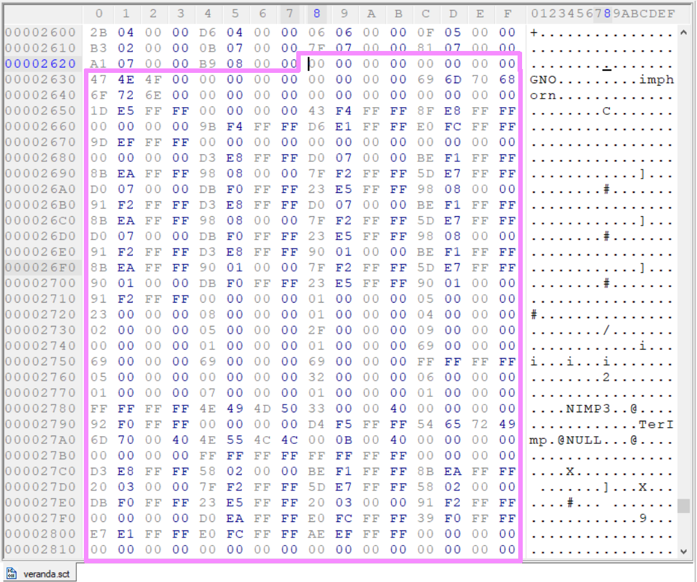

[<- Go Back](./format.md)

# The data section
As the name implies, this section holds all the data.

 The data section seem to contain the following types: (abstractly, it actually just contain raw data)
1. Integer
2. Array of Integers
3. String
4. Pointer to data

How will we know which one we're dealing with?

well, a *string* is made of ascii characters terminated with a nullbyte and is probably recognizable in any hex editor thus making it easy to tell. 

A *pointer* to another data is also easy to recognize since it is recorded in the [link table](./link.md)!

We are left with *integer* and an *array of integers*. The way I tell them apart is by checking out all the refernces to the data section via the [link table](./link.md), I calculate the distance between two consecutive references, if it's more than 4 bytes then I assume this is an array and divide the distance by 4 to get the number of integers in it. otherwise I assume it's an integer.

Here's how the data section of veranda.sct looks like inside a Hex editor:

