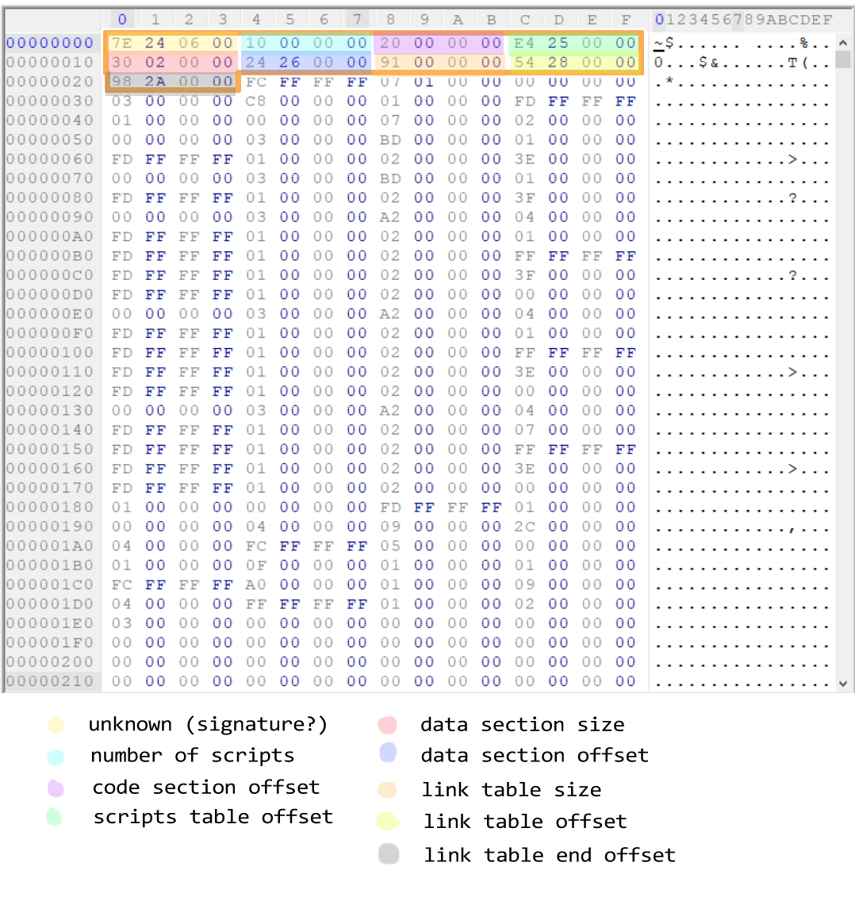

[<- Go Back](./format.md)

## The header
This section is basically an integer (4 byte) table that record information about the file itself.
it's size is 36 (0x24) bytes long.
- (offset: 0x00) the first 4 bytes are unknown and doesn't seem to matter (perhaps a signature of sorts).
- (offset: 0x04) these 4 bytes are an integer representing the number of scripts[^1] in the file.
- (offset: 0x08) these 4 bytes are the [code section](./code.md)'s offset from the fourth byte of this file.
- (offset: 0x0C) these 4 bytes are the [script table](./script.md) offset. script numbering is determined by the order of this table.
- (offset: 0x10) these 4 bytes are an integer representing the [data section](./data.md) size in bytes.
- (offset: 0x14) these 4 bytes are the [data section](./data.md) offset.
- (offset: 0x18) these 4 bytes are an integer representing the [link table](./link.md) size.
- (offset: 0x1C) these 4 bytes are the [link table](./link.md) offset.
- (offset: 0x20) these 4 bytes are an offset to the end of the file.

[^1]: A script in an .sct file is a code block (list of instructions) to be executed. (similar to a void function).
