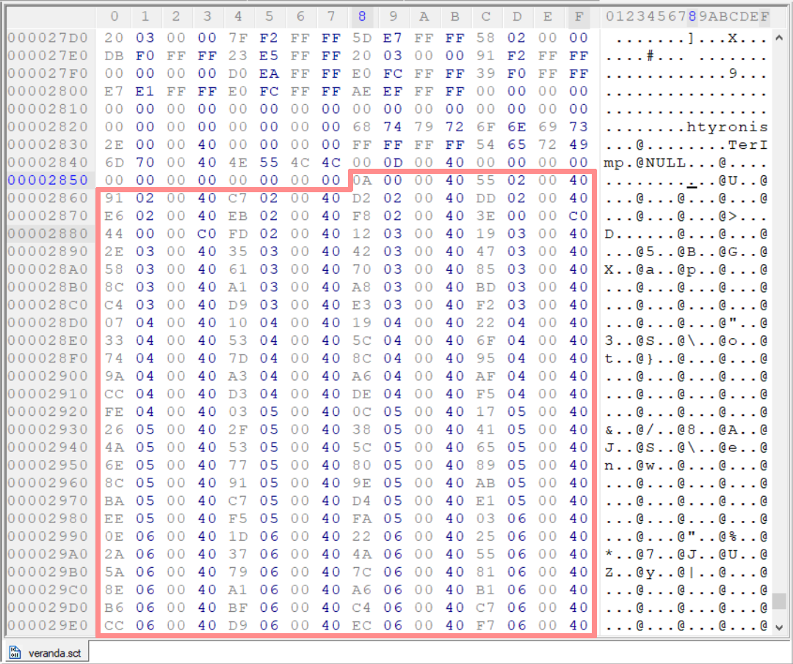
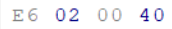
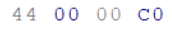
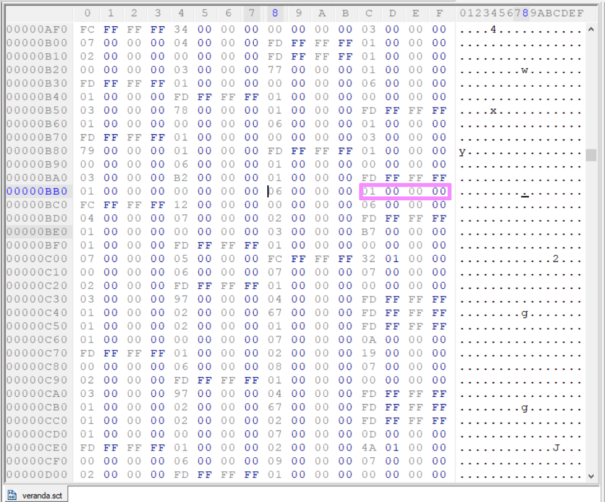
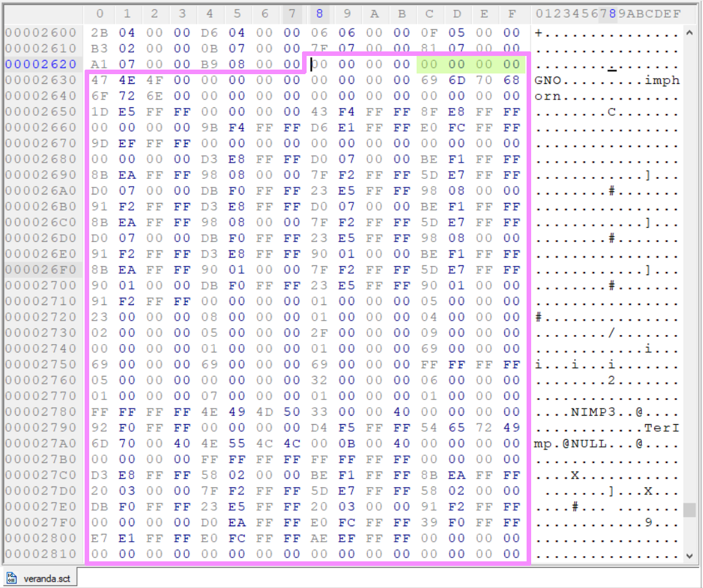

[<- Go Back](./format.md)

## The Link table
I call it the link table since it basically links the code section with the data section (or more accurately a reference to a variable with it's actual runtime memory address),

how? for instance by replacing a reference to variable number 5 (meaning the 5th integer from the start of the data section) to it's actual memory address in runtime! all the interpreter needs is all the places where such replacement needs to happen. (the link table)

Each link is 4 bytes long (surprising, i know.) and is simply composed of 3 bytes for the offset where the link should be (meaning: where the number should be replaced with it's actual address) and one byte to denote the type of link to be made.

Let's take a look at the [veranda.sct](./veranda.sct) link table:


### there are two types of links:
1. data reference inside the code section.
denoted by its first byte: ``` 0x40 ```
This link tells the interpreter that the offset is from the beginning of the code section. and it look like so: (offset 0x02E6 from the start of the code section)


2. data reference inside the data section.
denoted by its first byte: ``` 0xC0 ```
This link tells the interpreter that the offset is from the beginning of the data section. and it look like so: (offset 0x44 from the start of the data section)


Please note that the offset is the number of integers from the starting position, meaning that if you want to get the address in the file you need to multiply it by 4. for example: 
```
the link is: 0x400002E6 (or as it appears in the file: E6020040)
so the type is 1 (first byte 0x40),
and the offset is 0x02E6 from the start of the code section (position 0x24 from the beginning of the file)

and so 0x02E6 * 0x04 + 0x24 = 0x0BBC is the address (or rather offset) from the top of the file. 
```
Let's take a look:




and so 01 is the index of the data item, it is referencing the second integer in the data table (zero indexing).

which happens to be this integer (the number zero):



_the beginning of the data section is marked in pink and the actual data is marked in green._

That's how the link table works. I used it in the tool's code to try and determine the length of each variable in the file by checking all the references in the link table, the distance between 2 consecutive references was assumed to be the length of the variable.
the downside of this method is that an unused variable will not be present in the link table section and therefore the tool will assume it's a part of the previous variable's data, it should'nt affect the file's execution though.