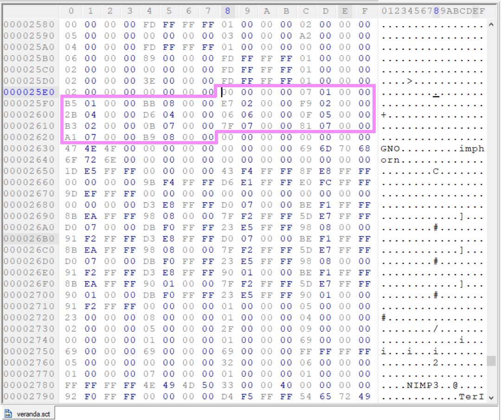
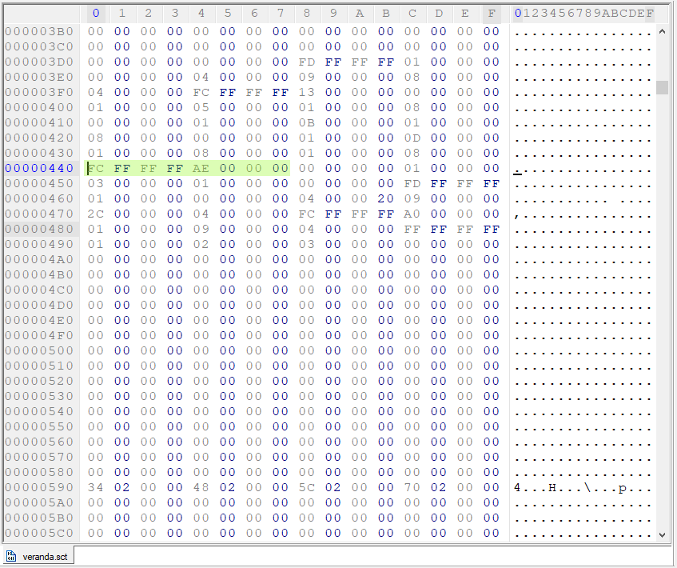

[<- Go Back](./format.md)

# The scripts offset table
This section is relatively straightforward, every 4 bytes is an offset to the beginning of a script ([code block](./code.md#code-block)).
this offset is calculated from the start of the code section (0x24) and is denoting the number of integers from that point onward.

Let's take a look inside veranda.sct's scripts table (using a Hex editor):



_As one can observe, there are 16 scripts (pointers) in this table_

If one wants to locate the address/ offset inside the file, one should simply multiply the offset by 4 and add the code section's offset to it like so:

```
Let's assume the script's offset inside the scripts offset table is: 0x00000107
Or is it appears inside the file: 07010000

The code section offset is: 0x00000024

Therefore: 0x00000107 * 0x00000004 + 0x00000024 = 0x00000440

```

Here's the script's [code block](./code.md#code-block):




