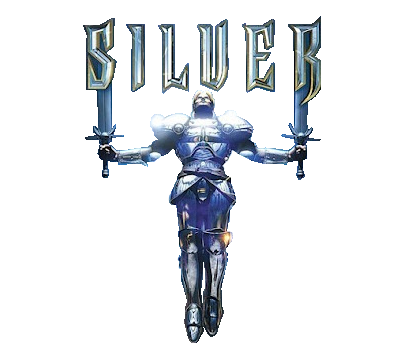

# Silver .sct reverse engineering & modding tool

A tool created to read and modify internal scripts of a game called '[Silver](https://en.wikipedia.org/wiki/Silver_(video_game))' - an action RPG from 1999 developed by Spiral House and published by Infogrames.


## Introduction

This tool’s purpose is to decompile the game’s .sct files to a readable file format (.tsct) and to compile it back into .sct format that the game’s engine can read.

This tool was created to further investigate the game’s inner workings.

This project is made of 3 major parts:
1. **Reverse engineering** -> the .sct binary files and related assets.
2. **Decompiler** -> from .sct binary to a scripting language (.tsct - "Translated SCT").
3. **Compiler** -> from .tsct scripting language back to .sct binary format.

## Examples

#### Reversed .sct files:
All the game's decompiled files can be found inside the [./out](./out) folder.

some examples are:
[veranda.tsct](./out/veranda.tsct), [gnolib2.tsct](./out/gnolib2.tsct), [davhouse.tsct](./out/davhouse.tsct), [courtyrd.tsct](./out/courtyrd.tsct)


#### Mods:
An example mod was created with this tool to satisfy the request of @theruler (steam user).
This mod makes Rain's "bell code" puzzle to work as it was originally designed on older computers. 

[Towngate Mod](./out/mods/easier_bell_pwd)  ( [tsct](./out/mods/easier_bell_pwd/towngate.tsct) | [sct](./out/mods/easier_bell_pwd/towngate.sct) | [readme](./out/mods/easier_bell_pwd/how%20to%20use.txt) )

_(on modern operating systems the 'bell code' timer got messed up thus the puzzle became near impossible to complete without help)_


## Docs
Further information can be found [here](./docs/index.md).

## Usage
**Note:** The files generated will **overwrite** your original files so you probably should **backup** your files first!
- The 'decompile' command is used to decompile from .sct to .tsct
- the 'compile' command is used to compile from .tsct to .sct

```
Usage: ./sct.exe [operation] [full_path_to_sct/tsct file]
```
for instance:
In order to translate veranda.sct file, We can use the command:
```
.\sct.exe decompile "D:\SteamLibrary\steamapps\common\Silver\silver\levels\gno\veranda\veranda.sct"
```
The above command will generate a veranda.tsct file in the same directory as the path.

In order to translate veranda.tsct back to veranda.sct we use:
```
.\sct.exe compile "D:\SteamLibrary\steamapps\common\Silver\silver\levels\gno\veranda\veranda.tsct"
```

## Building

Using gcc, while in this readme.md directory:

```
gcc -I .\ .\utils.c .\sct\sct.c .\sct\structure\object.c .\sct\structure\pattern.c .\sct\print\asm\console.c .\sct\game\gamefunc.c .\sct\convert\convert.c .\sct\convert\asm\sctasm.c .\sct\convert\bin\sctbin.c .\sct\catalog.c .\file\fileutils.c .\sct\print\bin\console.c .\sct\game\gamevar.c .\sct\print\bin\file.c .\sct\print\asm\file.c -o .\sct.exe
```

_This tool is work in progress, if you find any bugs or other issues please contact me._

## Related projects
### Silver Hacks
While working on this project, I made a few hacks that helped testing silver scripts easier, and theyre fun to play with!

[Silver hacks github page](https://github.com/nadavshemesh/silver-hacks)

#

<p align="center">
    
</p>

