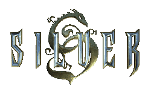

# Silver .sct reverse engineering & modding tool

A tool created to read and modify internal scripts of a game called '[Silver](https://en.wikipedia.org/wiki/Silver_(video_game))' - an action RPG from 1999 developed by Spiral House and published by Infogrames.


## Introduction

This tool’s purpose is to translate the game’s .sct files to a readable file format (a somewhat arbitrary scripting language I came up with to make sense of it’s binary format) and to translate it back into .sct format that the game’s engine can read. This tool was created to further investigate the game’s inner workings.

Currently, This tool can: 

1. Translate most .sct files to a .tsct text file (it’s structure and rules are explained in the docs)
2. Translate .tsct script file back to .sct format that can be executed by the game’s engine.

## Examples
Example .tsct files can be found inside the [./out](./out) folder.
[veranda.tsct](./out/veranda.tsct), [gnolib2.tsct](./out/gnolib2.tsct), [davhouse.tsct](./out/davhouse.tsct), [courtyrd.tsct](./out/courtyrd.tsct)


## Usage
**Note:** The files generated will **overwrite** the file so you definately should **backup** your files first!
- The 0 command is used to convert from .sct to .tsct
- the 1 command is used to convert from .tsct to .sct
```
Usage: ./sct.exe [operation (ie 1 or 0)] [full_path_to_sct/tsct file]
```
for instance:
In order to translate veranda.sct file, We can use the command:
```
.\sct.exe 0 "D:\SteamLibrary\steamapps\common\Silver\silver\levels\gno\veranda\veranda.sct"
```
The above command will generate a veranda.tsct file in the same directory as the path.

In order to translate veranda.tsct back to veranda.sct we use:
```
.\sct.exe 1 "D:\SteamLibrary\steamapps\common\Silver\silver\levels\gno\veranda\veranda.tsct"
```
Some important basic info about .sct execution:
1. the top script is the main script to be called on load.
2. the second one below it will always be run as infinite loop.
3. the third one from the top is executed when the player exits the room.

## Docs
Further information can be found [here](./docs/index.md).

## Building

Using gcc, while in this readme.md directory:

```
gcc -I .\ .\utils.c .\sct\sct.c .\sct\structure\object.c .\sct\structure\pattern.c .\sct\print\asm\console.c .\sct\game\gamefunc.c .\sct\convert\convert.c .\sct\convert\asm\sctasm.c .\sct\convert\bin\sctbin.c .\file\fileutils.c .\sct\print\bin\console.c .\sct\game\gamevar.c .\sct\print\bin\file.c .\sct\print\asm\file.c .\eng\eng.c -o .\sct.exe
```

_This tool is work in progress, so it’s unstable, buggy and has missing features._
